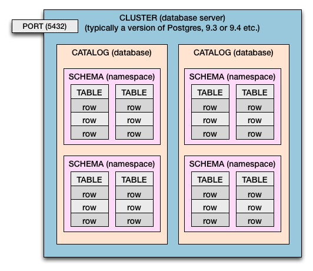

# spring-boot-multitenant

POC para aplicações multitenants springboot

The DDL to
create the table are present in DDL.sql in resources folder.

## Note: Once Multi-Tenancy is enabled all the DDL needs to be executed manually before staring the application

Before, create database and tabeles with commands in [etc/DDL.sql](etc/DDL.sql) file